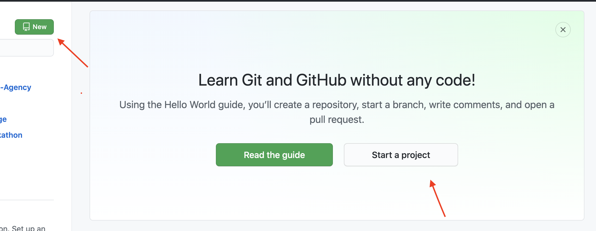
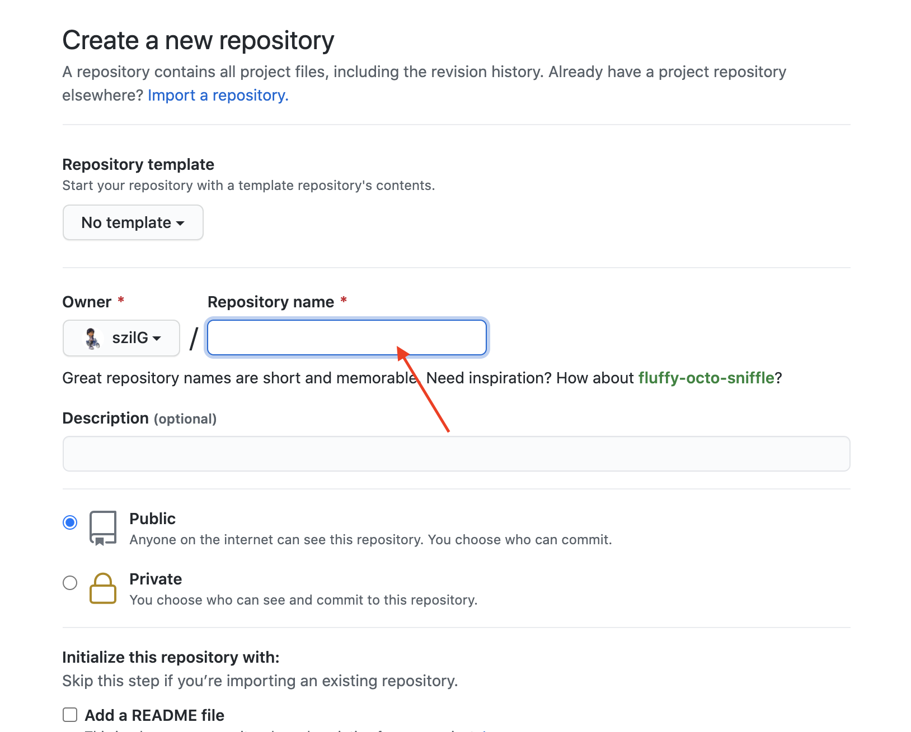
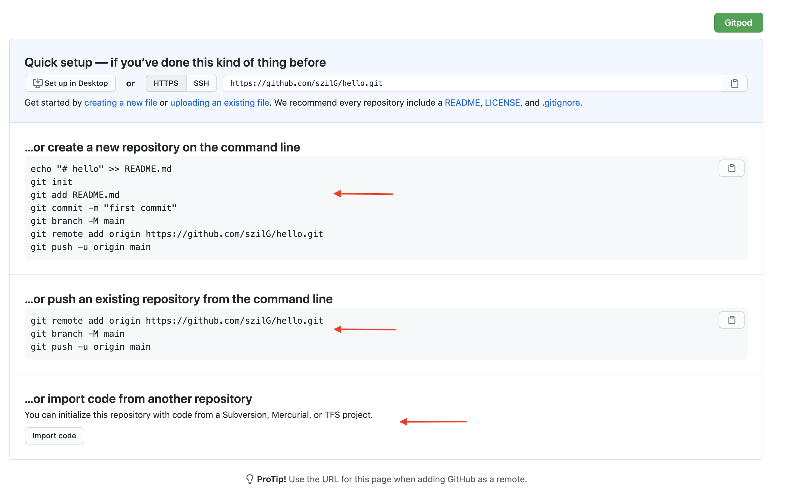

# [Red Coral Realty](https://szilg.github.io/Red-Coral-Realty/)

This is an imaginary website for a real estate company!
Wich can provide a wide range of properties and services.

[Mockup vector created by rawpixel.com](https://www.freepik.com/vectors/background)

The website features slideshows, testimonials, a page with all of the offers, and a contact page.
The main goal of the website is to guide possible clients to making contact with the agency through the contact page.

The business goals of the website are:
Get the Best Price for Your Property in the Shortest Time for the Lowest Fee.
Pay a Fixed Fee & Keep Your Equity.

## UX

**The ideal clients for this business are:**

 * Everyone on this planet who wants to sell, buy, let or rent.

**Client stories**
 * As a potential customer, I want to easily navigate throughout the site and find what I need.
 * As a potential customer, I want to easily find the best price to the property even selling or buying.
 * As a potential customer, If want to sell my property I want to know their charges and fees.
 * As a possible customer, I want to know what former clients thought of their works.
 * As an interested customer, I want to see wide range of services.
 * As an interested customer, I want to easy navigate to contact/book page.
 * As an interested customer, I want to calculate mortgage repayment and to know how to apply mortgages.
 * As an interested customer, I want to find advice for buying.
 * As an interested customer, I want to see their research of the market and their research team.
 * As an interested customer, I want to see how follow them on social media.
 

**Wireframe mockups:** 

Wireframe information can be found in the separate [Wireframe pdf file.](https://github.com/szilG/Red-Coral-Realty/tree/main/wireframe)

## Features

Each page has a responsive navigation bar with a Company Logo.
Each page has a footer with copyright information company address, phone number, social links and links to navigate to another page.

**Home page features:**

The home page has an image carousel with a carousel text at the top.
Information for the agency's services with a call to action buttons.
A little info about the agency properties with a "Read More" call to action buttons.
There is a Mortgage calculator where the customers can calculate their mortgage repayments with a "Request" button.
There is a call to action button that takes the user to the Contact page.

**Local Properties page features:**

The page has a little information about the properties with a "View Property" call to action buttons.
The page has a Overview of the Home Buying Process section with clickable call to action buttons.

**Properties Abroad page features:**

The page has a little information about the properties with a "View Property" call to action buttons.
The page has a Overview of the Home Buying Process section with clickable call to action buttons.

**Mortgage page features:**

In the top section of the page has information and a "Contact us" call to action button.
There is a Mortgage calculator where the customers can calculate their mortgage repayments.
There are four section with advice and tips for the costumers and a "Contact us" call to action buttons.

**Research page features:**

Information about the market research and the company research Team.

**Advice for buyers page features:**

Informations, advices and tips for the buyers.

**Request Valuation page features:**

Information and tips about selling a property. A contact form and an information about the agency Valuation Team.

**Contact page features:**

Information and a contact/feedback form.

### Existing Features

* Every page has **Header Logo** - Clicking the logo returns users to the home page.
* Every page has a **Footer** - The navigation links, information about the company address, social icons. 
* Every page has **Footer Copyright Info** - Business copyright.
* Every page has a **Call to Action Button** -  Allows users to contact the agency.
* Every page has a **Back to top Button** -  Clicking the button takes the user back to the top.

## Technologies Used

* The project uses HTML and CSS and Javascript programming languages.
* [Visual Studio Code](https://code.visualstudio.com/)
The developer used Visual Studio Code to build this website.
* [Bootstrap](https://getbootstrap.com/)
The project was build with **Bootstrap4.6**.
* [EmailJS](https://www.emailjs.com/)
This project use EmailJs to send email directly from Javascript.
* [SwiperJs](https://swiperjs.com/demos)
The project use SwiperJs 
* [ScrollReveal](https://github.com/jlmakes/scrollreveal)

## Testing
Testing information can be found in separate [Testing.md file.](https://github.com/szilG/Red-Coral-Realty/blob/main/TESTING.md)

## Deployment
This project was developed [Visual Studio Code](https://code.visualstudio.com/) using git and pushed to GitHub using the built-in function within Visual Studio Code.
Deploy this project

1. First you need a valid GitHub accont and you need a project to deploy a static website.
    How to create a GitHub accont [find more here](https://github.com/)
2. Go to GitHub and sign in with your credentials.
3. Create a new repository by clicking a Start a project button or you can click the green button with New in it.
    
4. Give name to the Repository.
    
5. Your repo is created. 
   There are three ways to upload Html code. Follow the one you would like to push your code into GitHub.
    
6. Make sure you have git install in your system. How to install Git you can [find more here](https://git-scm.com/book/en/v2/Getting-Started-First-Time-Git-Setup).

   Follow the instructions and push your code into origin main branch.
7. Ones you have transferred all the files on your GitHub repository from the menu select Settings

8. Scroll down to the GitHub Pages section.
9. Under Source click the drop-down menu -by default is labeled None- and select **Main/Master** branch and click the Save button.
    Ones you clicked on the save button you will be able to see this message -Your site is published at this url http://username.io/repository-name/ 

10. You can click on it and it will open in a new tab. Your website is live in this url http://username.io/repository-name/. The website is now deployed.

## How to run this project locally
To clone this project into Gitpod you will need:
* A Github account. [Create here](https://github.com/)
* Chrome or Firefox browser.

1. Install the Chrome or Firefox gitpod [Extension](https://www.gitpod.io/docs/browser-extension/)
2. Log into GitHub with your github account.
3. Navigate to the [Project Repository](https://github.com/szilG/Yes-I-Do-Wedding-Agency)
3. The "Gitpod" button is in the top right corner of the repository now. 

4. Click on the "Gitpod" button that will open a gitpod workspace where you can work locally with the code.

To work on the project within a local system such as VSCode etc:
1. Navigate to the [Project Repository](https://github.com/szilG/Red-Coral-Realty)
2. Click on the Code button (next to the green Gitpod button) and choose to Clone or Download zip file.

3. If you choose clone in the HTTPs section copy the URL for the repository.

4. In your local system open the terminal.
5. Change the working directory to the location where you want the clone the repository.
6. Type `git clone`, and then paste the URL you copied earlier.

   `$ git clone https://github.com/YOUR-USERNAME/YOUR-REPOSITORY`

7. Press Enter to create your local clone.

If you have any trouble cloning the repository further information can be found [here](https://docs.github.com/en/free-pro-team@latest/github/creating-cloning-and-archiving-repositories/cloning-a-repository)

## Credits

#### Media
* The images vectors and icons are taken from

  - [UNSPLASH.com](https://unsplash.com/)
  - [iStock - by Getty Images](https://www.istockphoto.com/)
  - [Google Search](https://www.google.com/)
  - [Font Awesome](https://fontawesome.com/)
  - [CleanPNG](https://www.cleanpng.com)

#### Content
* The text was copied from
  - [O'Dwyer Real Estate Managment](https://odrem.ie/)
  - [Auctioneera - A NEW ERA IN ESTATE AGENCY](https://www.auctioneera.ie/)
  - [PrimeLocation - Find your dream home](https://www.primelocation.com/)
  - [Sherry FitzGerald](https://www.sherryfitz.ie/)
  - [Rettie - Property with Caracter](https://www.rettie.co.uk/)
  - [DeZeen](https://www.dezeen.com/)

#### Code
* Screenshot images in the deployment section was taken from 
  - [gitpod browser-extension](https://www.gitpod.io/static/b2f7a9dd0909631d5530b3eb59cc6d31/a370b/browser-extension-lense.png)
  - [github settings button](https://content.codecademy.com/courses/freelance-1/unit-3/git%20setup/githubsettings.png)
  - [github pages](https://s3.us-west-1.wasabisys.com/idbwmedia.com/images/api/githubpagesscreenshot.png)
* JS code for the Mortgage calculator was originally taken from [Adam Khoury](https://www.youtube.com/watch?v=vkBiEuZSq9s) and modified for the project's needs.
* The project use [EmailJs]( https://www.emailjs.com/)
* JS code for the Animation on Scroll was originally taken from [Julian Lloyd](https://github.com/jlmakes/scrollreveal) and modified for the project's needs.
* JS code for Swiper slideshow was originally taken from [SwiperJS](https://swiperjs.com/demos#space-between) credit goes [Vladimir Kharlampidi](https://github.com/nolimits4web/Swiper/blob/master/demos/150-freemode.html) and modified for the project's needs.
* JS code for the Dynamic Dependent Dropdown List was originally taken from [Webslesson](https://www.youtube.com/watch?v=1ebJyK6tocI) and modified for the project's needs.

#### Acknowledgements
* Many Thanks to my mentor Akshat Garg who was brilliant and gave me lots of help with how to generate property details with javascript and helped me throughout this project.

##### Disclaimer
This project was made as my 2st. Milestone Project in [Code Institute](https://codeinstitute.net/5-day-coding-challenge/?utm_term=%2Bcode%20%2Binstitute&utm_campaign=a%26c_BR_IRL_Code_Institute&utm_source=adwords&utm_medium=ppc&hsa_net=adwords&hsa_tgt=kwd-319867642491&hsa_ad=326751276603&hsa_acc=8983321581&hsa_grp=56427889178&hsa_mt=b&hsa_cam=1378516521&hsa_kw=%2Bcode%20%2Binstitute&hsa_ver=3&hsa_src=g&gclid=EAIaIQobChMIiJjgxOrD7QIVz8LtCh3OQQgLEAAYASAAEgLd4vD_BwE&gclsrc=aw.ds)
