# RED CORAL REALTY - Testing Details

[README.md file](https://github.com/szilG/Red-Coral-Realty/blob/main/README.md)

## Testing 

### Client stories testing

As a potential customer, I want to easily navigate throughout the site and find what I need.

* As every page has a navigation bar on the top and bottom of the page, the customer can easily find and navigate through the site.

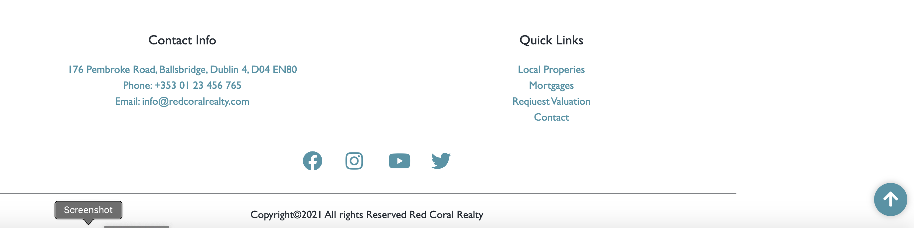

* As every page has a company logo image that when clicked takes the customer back to the Home page.

* As every page has a back to top button. When the customer scrool down on the page that button appears and with the button clicking they can easily go back to the top of the page.

* The home page has many call-to-action buttons which take the user to the specific page.
  - Right away in the hero section they can book a Valuation to their property.
    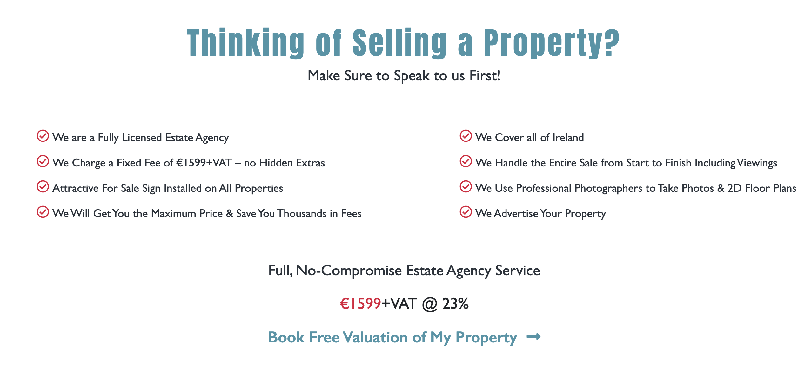
  - Further along there are the read more buttons which takes the user to check the desired property.
    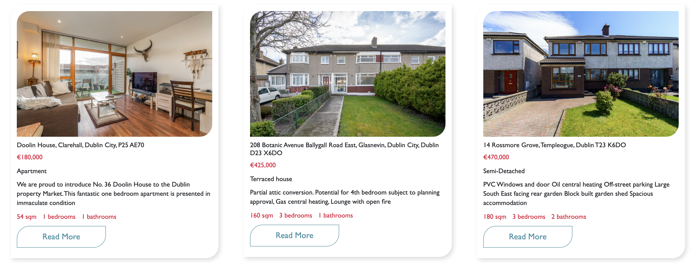
  - They can book appointment for a valuation every section on the page.
    
    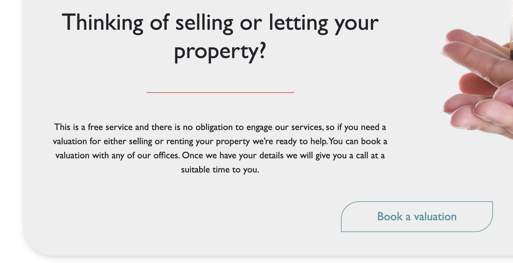
    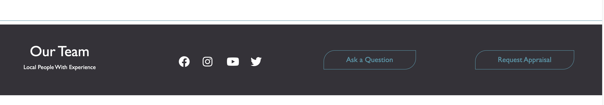

As a potential customer, I want to easily find the best price to the property even selling or buying.

* Clickable Local Properties and Properties Abroad menu is on every page, in the top navigation bar, and in the footer. The customers can easily find and navigate to the properies page.

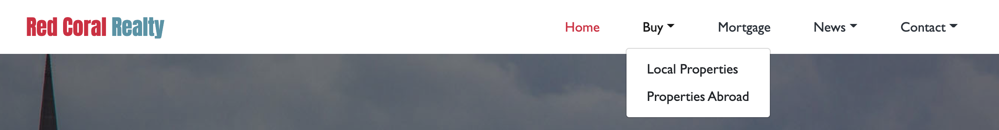

* On the Home page there are two section with properies: local properties and the overseas properties.
Each one is clickable and takes the customer to the selected property page.
* There are a clickable -All Properties- button which takes the user to the properties page and they can look over all of the properties.

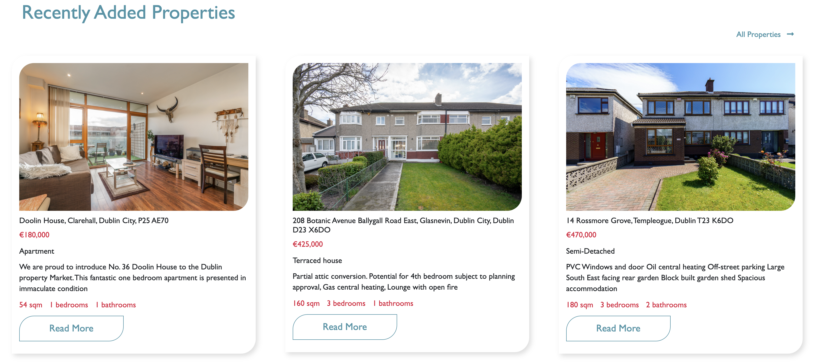

As a potential customer, If want to sell my property I want to know their charges and fees.

* On top of the Home page there is section which tell the user the agency prices, what they offer and the clickable button to the booking valuation page.

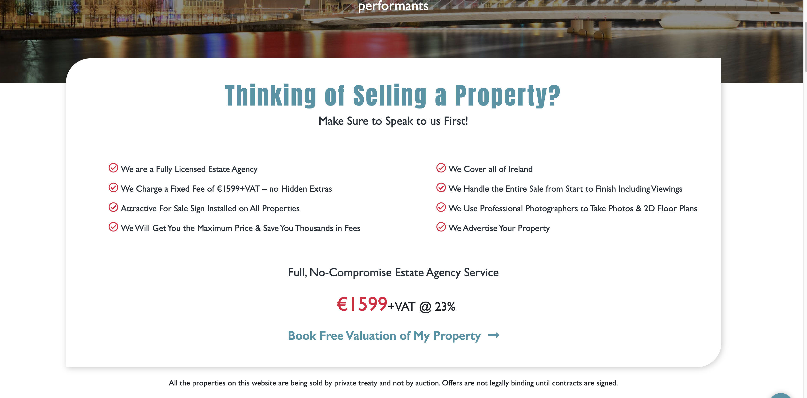

As a possible customer, I want to know what former clients thought of their works.

* On the Home page there is a testimonials section with the previous customers thoughts.

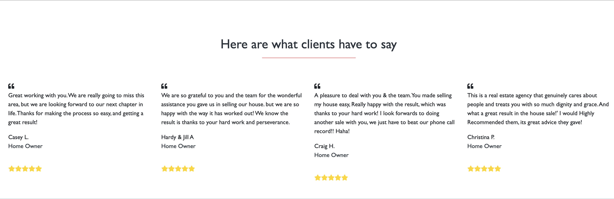

As an interested customer, I want to see wide range of services.

* On the Home page there is a morgtgage calculator that the customers can use to easily calculate their mortgage repayments.
Or they can click on the Request button next to the calculator and it will take them to the mortgage page. They can find tips, advice and contact buttons that will lead them to the contact page.

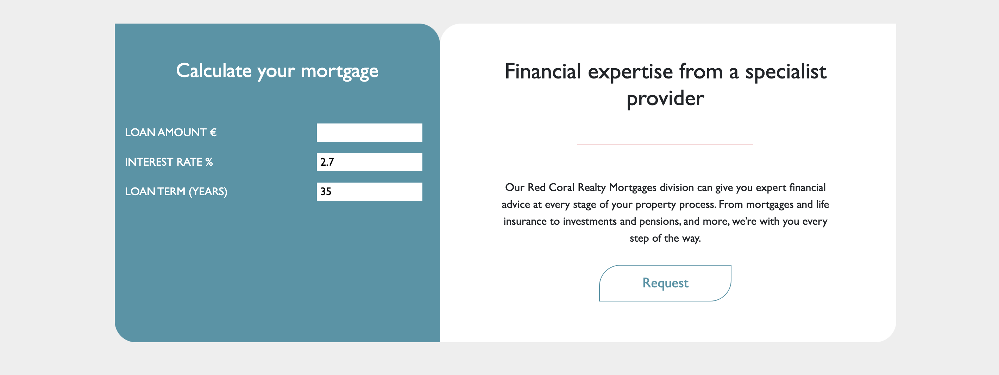

* There is a middle section when the customers can reed further services.

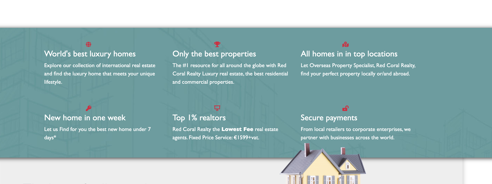

* On the Home page there are three clickable section which takes the users to the pages. They can find advice for buying, advice how to apply for mortgage and the user can be familier with the company market research and their research team.

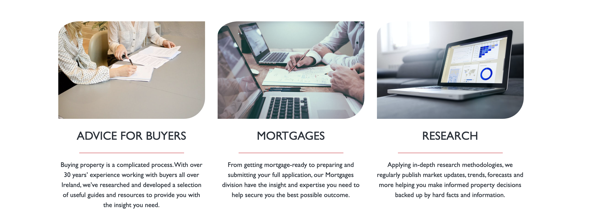

As an interested customer, I want to easy navigate to contact/book page.

Every page offers opportunity to contact with the agency. Several call to action buttons on the pages.
* On the Home page in the top and bottom navigation menu has a contact button. The user easily can navigate to the contact page.

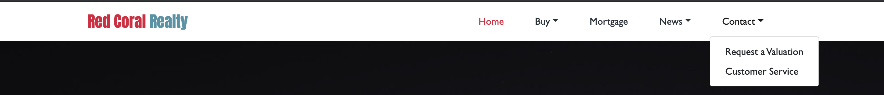

* On the Home page there are call to action button which takes the user to a valuation page. Where they can easily contact with the agency.

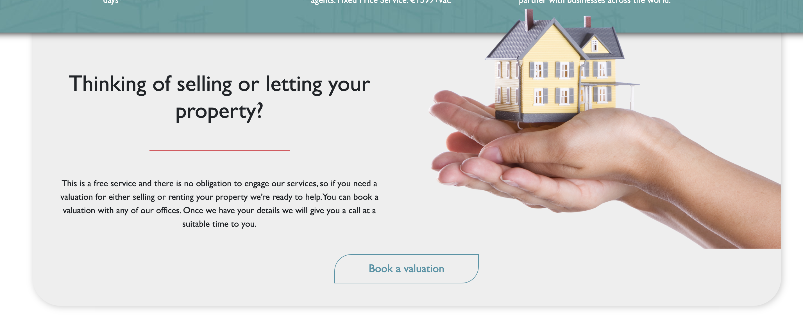

* On the Home page there is call to action button which takes the user to a contact page. Where they can easily contact with the agency.

As an interested customer, I want to I want to calculate mortgage repayment and to know how to apply mortgages.

* On the Home page there is a mortgage calculator that the customers can use to easily calculate their mortgage repayments.

* In the top and bottom navigation menu has a clickable mortgages button which takes to the user to the mortgage page. Where they find tips, advices how to get mortgage and the page also contains mortgage calculator.

* On the bottom of every page has a clickable mortgage section which takes the user to the mortgage page.

As an interested customer, I want to find advice for buying.

* In the navigation menu has a clickable button to the advice to buyers page.

* On the Home page there is clickable section which takes the users to the Advice page. They can find advice and usefull tips for buying.

As an interested customer, I want to see their research of the market and their research team.

* In the navigation menu has a clickable button to the research page.

* On the Home page there is clickable section which takes the users to the Research page. The users can reed about their research and meet the research team.

As an interested customer, I want to see how follow them on social media.

* In the bottom of the navigation menu contains clickable social icons which takes the user to the desired social page.

* On the home page they can find more opportunity to contact with the agency social pages.

### Testing functionality of every page

**Home page:**

Navigation bar:

   * I checked the navigation's responsiveness by changing the screen size from desktop to tablet, to phone. Burger Icon dropdown menu in the correct place. Works as expected.
   * I clicked on each navigation menu item and confirmed that it links to the correct page.

Image Carousel:

   * I checked the image carousel by changing the screen size from desktop to tablet, to phone. Image carousel works as expected.

Content:

   * I checked the text and image by changing the screen size from desktop to tablet, to phone.
   Works as expected and looks good on all device widths.

Call to action buttons:

   * I checked the responsiveness by changing the screen size from desktop to tablet, to phone.
   * I hovered over each button and checked their color change.
   * I clicked on each button to check it leads to a correct page.

Back to top button:

   * I clicked on it and it goes back to the top of the page. Works as expected.

Footer:

   * I checked the footer by changing the screen size from desktop to tablet, to phone. Works as it expected.
   * I clicked on each navigation link to confirm it takes the user to the chosen page.
   * I hovered over the links, their color changed.
   * All of the social icons connected.

**Local Properties page:**

Navigation bar:

   * Repeat validation steps done for Navbar on the Home page.
   * All navigation links are connected.

Content:

   * I checked the text and images by changing the screen size from desktop to tablet, to phone.
   * All property links are connected works as it expected.

Footer:

   * Repeat validation steps done for Footer on the Home page.

Back to top button:

   * I clicked on it and it goes back to the top of the page. Works as expected.

**Properties Abroad page:**

Navigation bar:

   * Repeat validation steps done for Navbar on the Home page.
   * All navigation links are connected.

Content:

   * I checked the text and images by changing the screen size from desktop to tablet, to phone.
   * All property links are connected works as it expected.

Footer:

   * Repeat validation steps done for Footer on the Home page.

Back to top button:

   * I clicked on it and it goes back to the top of the page. Works as expected.

**Mortgage page:**

Navigation bar:

   * Repeat validation steps done for Navbar on the Home page.
   * All navigation links are connected.

Contact Forms:

   I checked mortgage page all contact form.
   * I submitted the form with the Name field left empty and received an error message to fill out the required field.
   * I submitted the form with both an invalid email address and later an empty email address field and noticed that an error message to fill out the required field popped up.
   * I submitted the form with the Phone number field left empty and received an error message to fill out the required field.
   * I submitted the form with the Select Product field left empty and received an error message to fill out the required field.
   * I submitted the form with every field filled in correctly and received a "Your mail was send" message.
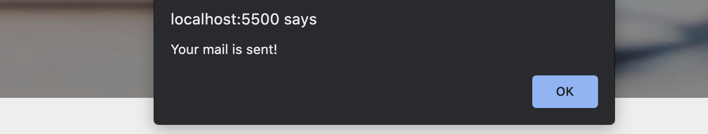

Content:

   * I checked the text and images by changing the screen size from desktop to tablet, to phone.
   * All property links are connected works as it expected.

Footer:

   * Repeat validation steps done for Footer on the Home page.

Back to top button:

   * I clicked on it and it goes back to the top of the page. Works as expected.

**Research page:**

Navigation bar:

   * Repeat validation steps done for Navbar on the Home page.
   * All navigation links are connected.

Content:

   * I checked the text and images by changing the screen size from desktop to tablet, to phone.

Footer:

   * Repeat validation steps done for Footer on the Home page.

Back to top button:

   * I clicked on it and it goes back to the top of the page. Works as it expected.

**Advice for Buyers page:**

Navigation bar:

   * Repeat validation steps done for Navbar on the Home page.
   * All navigation links are connected.

Content:

   * I checked the text and images by changing the screen size from desktop to tablet, to phone.

Footer:

   * Repeat validation steps done for Footer on the Home page.

Back to top button:

   * I clicked on it and it goes back to the top of the page. Works as expected.

**Request Valuation page:**

Navigation bar:

   * Repeat validation steps done for Navbar on the Home page.
   * All navigation links are connected.

Contact Form:

   * I checked the Radio buttons works as it expected.
   * I checked the contact form's responsiveness by changing the screen size from desktop to tablet, to phone.
   * I submitted the empty form and an error message popped up about filling in the required fields.
   * I submitted the form with the Location field left empty and received an error message to fill out the required field.
   * I submitted the form with the Area field left empty and received an error message to fill out the required field.
   * I submitted the form with the Name field left empty and received an error message to fill out the required field.
   * I submitted the form with both an invalid email address and later an empty email address field and noticed that an error message to fill out the required field popped up.
   * I submitted the form with the Phone number field left empty and received an error message to fill out the required field.
   * I submitted the form with the Select Preferred Callback Time field left empty and received an error message to fill out the required field.
   * I submitted the form with every field filled in correctly and received a "Your mail was send" message.

Content:

   * I checked the text and images by changing the screen size from desktop to tablet, to phone.
   
Footer:

   * Repeat validation steps done for Footer on the Home page.

Back to top button:

   * I clicked on it and it goes back to the top of the page. Works as expected.

**Customer Sevice/Contact page:**

Navigation bar:

   * Repeat validation steps done for Navbar on the Home page.
   * All navigation links are connected.

Content:

   * I checked the text and images by changing the screen size from desktop to tablet, to phone.
   * All of the page links are connected.

Contact Form:

   * I checked the contact form's responsiveness by changing the screen size from desktop to tablet, to phone.
   * I submitted the empty form and an error message popped up about filling in the required fields.
   * I submitted the form with the Name field left empty and received an error message to fill out the required field.
   * I submitted the form with both an invalid email address and later an empty email address field and noticed that an error message to fill out the required field popped up.
   * Your Location field isn't required. The form can be submited without fill it!
   * I submitted the form with every field filled in correctly and received a "Your mail was send" message.

Footer:

   * Repeat validation steps done for Footer on the Home page.

Back to top button:

   * I clicked on it and it goes back to the top of the page. Works as expected.

### Validation Testing
* [W3C CSS Validation](https://jigsaw.w3.org/css-validator/)
* [W3C Markup Validation](https://validator.w3.org/) 

To solve W3C Markup Validation problem:

Home page:

1.
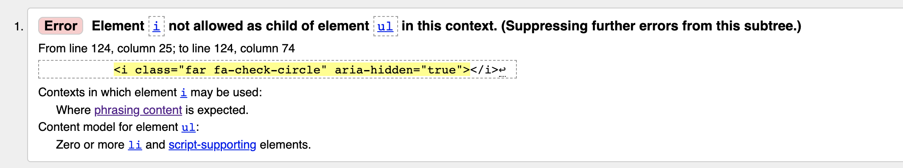

That problem was on Home page Hero Section. To solve this problem I wrap every i element inside li element.
I found the solution [here:](https://rocketvalidator.com/html-validation/element-div-not-allowed-as-child-of-element-ul-in-this-context-suppressing-further-errors-from-this-subtree)

2.
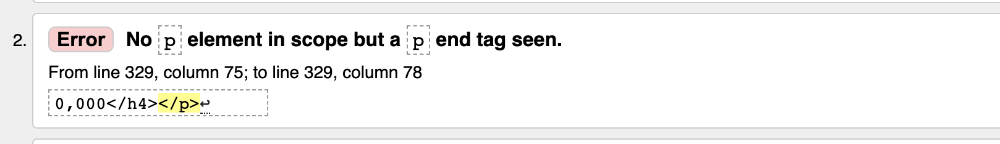

That problem was on Home page Properties Section. To solve this problem I separate p tag from h4 tag.
I found the solution [here:](https://stackoverflow.com/questions/21084870/no-p-element-in-scope-but-a-p-end-tag-seen-w3c-validation)

3.
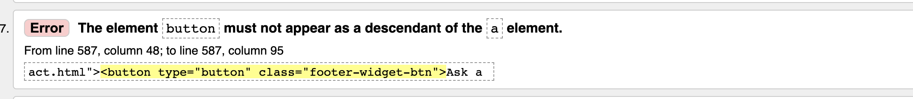

That problem was on Home page Footer widget Section. To solve this problem I simply delete the button tag.

4.
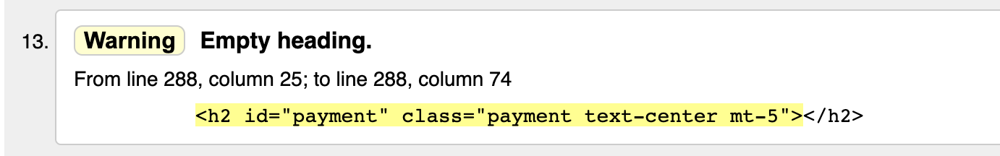

That problem was on Home page Mortgage Calculator Section. To solve this problem I used div element instead of h2 tag.
I found the solution [here:](https://stackoverflow.com/questions/23739224/empty-heading-warning-on-html5-validation#:~:text=The%20%22empty%20heading%22%20warning%20means,with%20which%20they%20are%20associated.)

Contact page:

1.
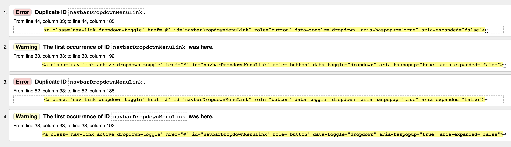

That problem was on Every page in the Header Section. To solve this problem I renamed the ID of navbarDropdownMenuLink.

2.
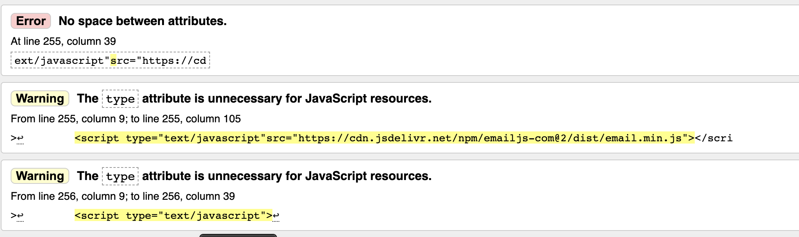

To solve this problem I gave space betweed the attributes and delete the type attribute.

Mortgages page:

1.
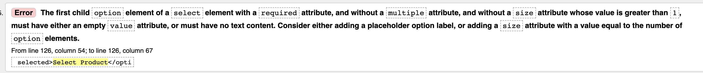

To solve this problem I gave empty value attribute to the first option element.

Request Valuation page:

1.
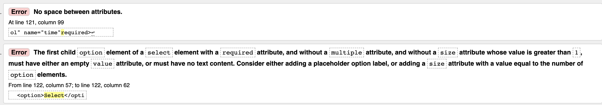

To solve this problem I gave empty value attribute to the first option element.
Put space between the attributes.

CSS Validation went through without any problem.

### Further testing:
I asked friends and family to look at the site on their devices and report any issues they find.

They reported some minor spacing propoblem on mobil size I solve this to adding margins and paddings

In final testing some issue occured:

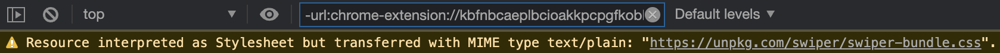

That issue is on the pages when the page use this Swiper bundle.
Spoke with my mentor Akshat Garg he told me the problem is not in my code, this is the problem on their end.

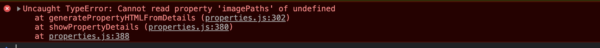

That problem was on Home, Local properties and Properties Abroad pages. Those page doesn't needed the proprties.js file.
To solve this problem I delete the properties.js script file of those page. 
